<p align="center">
  
</p>

<p align="center">
  
</p>

<p align="center">
  
  <a href="https://github.com/VBansal99?tab=followers"></a>
  <a href="https://www.linkedin.com/in/varun-bansal-242ba6204/"></a>
</p>

<br>


```kotlin
object Varun {
    val role       = listOf("QA Engineer", "Associate Software Developer")
    val base       = "Primebook India, New Delhi"
    val mainQuest  = "PrimeOS — an Android-x86 desktop OS"
    val sideQuests = listOf("Android ROMs", "Kernels", "AI assistants")
    val weakness   = "A clean Logcat. Never seen one."
}
```

> By day I hunt regressions across OTA updates, version migrations and accessibility on **PrimeOS**.
> By night I build ROMs, poke at kernels and teach my PC to listen.

<br>


| | Mission | Status |
|:-:|:--|:-:|
| 🧪 | **PrimeOS QA** · OTA validation, cross-version migration & Narrator/TalkBack parity |  |
| 🔮 | **Computer** · voice-controlled AI desktop assistant with a floating-orb UI |  |
| 📱 | **LineageOS 16.0 for Redmi Note 4 (mido)** · built from source, flashable |  |
| 🧱 | **[Custom-Data-Structure](https://github.com/VBansal99/Custom-Data-Structure)** & **[Text_Editor](https://github.com/VBansal99/Text_Editor)** · C++ from scratch |  |

<br>


<p align="center">
  
</p>

<p align="center">
  
  
  
  
  
  
</p>

<br>


<p align="center">
  
  
</p>

<p align="center">
  
</p>

<p align="center">
  
</p>

<br>


<p align="center">
  <a href="https://www.linkedin.com/in/varun-bansal-242ba6204/"></a>
  <a href="https://github.com/VBansal99?tab=repositories"></a>
</p>

<br>

<p align="center">
  
</p>
